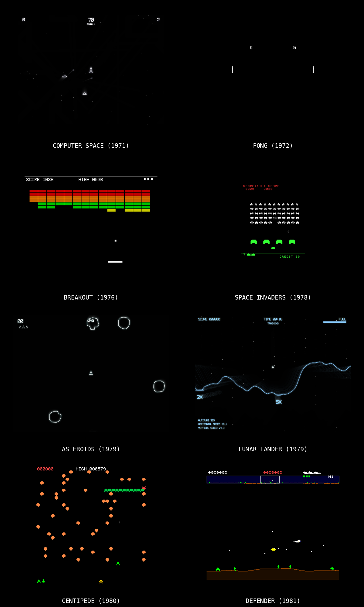

# Browser Games

Classic arcade games recreated in the browser with vanilla JavaScript and HTML5 Canvas. No frameworks, no build tools, no dependencies — just open and play.



## Games

| Game | Year | Description | Play |
|------|------|-------------|------|
| [Computer Space](computer-space/) | 1971 | The Nutting Associates original. The first commercially sold coin-operated video game. Newtonian physics with discrete 16-direction rotation, guided missiles, two AI saucers, time-based rounds, and monochrome CRT visuals with phosphor glow and scanlines. | Open `computer-space/index.html` |
| [Pong](pong/) | 1972 | The Atari original. The first commercially successful video game. Authentic 8-segment paddle deflection, progressive ball acceleration, monochrome CRT visuals with scanline effects, and square wave audio matching the original hardware tones. | Open `pong/index.html` |
| [Breakout](breakout/) | 1976 | The Atari classic. Smash through 8 rows of colored bricks with a bouncing ball and paddle. Cellophane color overlay, 4-level ball speed progression, paddle shrink after back-wall breakthrough, and authentic scoring (1/3/5/7 points per row pair). | Open `breakout/index.html` |
| [Space Invaders](space-invaders/) | 1978 | The Taito classic. Defend Earth from descending alien formations with your laser cannon. Pixel-accurate sprites, destructible shields with pixel-level erosion, cellophane color overlay, and attract screen gag animations from the original ROM. | Open `space-invaders/index.html` |
| [Galaxian](galaxian/) | 1979 | The Namco classic. The first arcade game with true RGB color. Dive-bombing aliens with bezier-curve attack paths, flagship convoy mechanics with escort bonuses, and a scrolling starfield. | Open `galaxian/index.html` |
| [Asteroids](asteroids/) | 1979 | The Atari classic. Pilot your ship through an asteroid field, blast rocks into fragments, and dodge UFOs. Vector-style graphics with phosphor glow effects, inertial physics, and hyperspace. | Open `asteroids/index.html` |
| [Lunar Lander](lunar-lander/) | 1979 | The Atari classic. Guide your lunar module to a safe landing on the moon's surface. Altitude-dependent zoom, procedural terrain with scoring pads, fuel management, four difficulty missions, and vector phosphor glow. | Open `lunar-lander/index.html` |
| [Centipede](centipede/) | 1980 | The Atari classic. Blast the centipede as it winds through a mushroom field. Tile-based mechanics with centipede splitting, poisoned mushrooms, spider proximity scoring, and the original 12-wave cycle. | Open `centipede/index.html` |
| [Defender](defender/) | 1981 | The Williams classic. Defend humanoids from alien abduction across a horizontally scrolling landscape. Multiple enemy types, smart bombs, hyperspace, and a minimap scanner. | Open `defender/index.html` |

## Design Philosophy

Each game follows the same conventions:

- **Single-file architecture** — all game logic lives in one `game.js` file, organized into clearly named sections (CONFIG, Math Utilities, Sprite/Shape Data, Sound Engine, Input Handler, Entity Classes, Collision System, Renderer, Game State Machine, Main Loop)
- **Zero dependencies** — vanilla JavaScript, HTML5 Canvas, and Web Audio API only
- **3-file structure** — `index.html` (shell), `style.css` (layout), `game.js` (everything else)
- **Authentic recreation** — faithful to the original hardware behavior, scoring systems, and visual style rather than "inspired by" reinterpretations
- **Procedural audio** — all sound effects synthesized at runtime via Web Audio API oscillators and noise buffers; no audio files
- **Fixed 60Hz timestep** — accumulator-pattern game loop with delta clamping for consistent physics regardless of display refresh rate

## How to Run

Clone the repo and open any game's `index.html` in a browser:

```bash
git clone https://github.com/juliensimon/browser-games.git
open browser-games/space-invaders/index.html
```

No server required — everything runs client-side.

## License

Fan recreations for educational purposes. All original games are trademarks of their respective owners.
