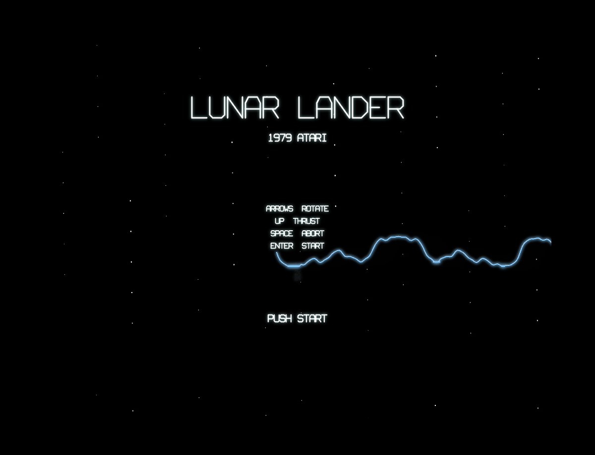
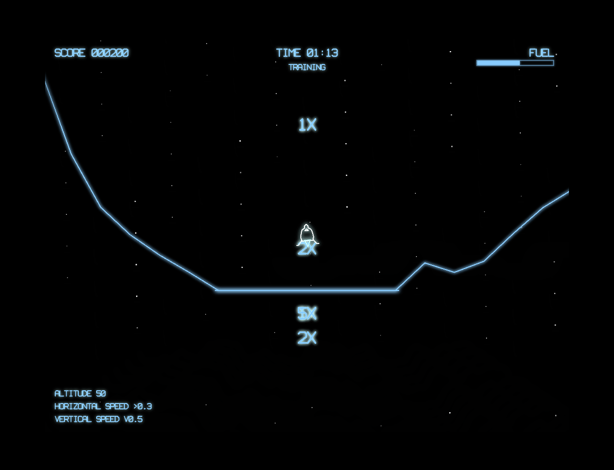

# Lunar Lander

A browser-based recreation of the classic 1979 Atari arcade game, built with vanilla JavaScript and HTML5 Canvas. Features authentic vector-style graphics with phosphor glow effects, smooth altitude-dependent zoom, procedural terrain with landing pads, and four difficulty missions.

## How to Play

Open `index.html` in any modern browser. No build step or dependencies required.

### Controls

| Key | Action |
|-----|--------|
| Arrow Left/Right (or A/D) | Rotate lander |
| Arrow Up (or W) | Thrust |
| Space | Abort (auto-rotate vertical + full thrust, heavy fuel cost) |
| Arrow Up/Down | Select mission (on mission select screen) |
| Enter | Start game / confirm mission |

### Goal

Land your lunar module safely on the flat landing pads scattered across the moon's surface. Each pad has a score multiplier (1X, 2X, or 5X) — smaller pads are worth more but harder to hit. You must land gently (low vertical and horizontal speed) and nearly upright (within 15 degrees of vertical).

The game continues until you run out of fuel. Good landings award a +50 fuel bonus, so skilled play extends your game.

## Features

- Vector-style rendering with CRT phosphor glow and vignette effects
- Smooth altitude-dependent zoom (overview at high altitude, close-up for landing)
- Procedural jagged lunar terrain with 5 flat landing pads (1X, 2X, 5X multipliers)
- 4 difficulty missions: Training (low gravity + friction), Cadet, Prime (strong gravity), Command (momentum rotation)
- Fuel management: 750 units, burn rate on thrust, low-fuel warning beep
- Abort mechanic: auto-rotates to vertical with full thrust at heavy fuel cost
- Three landing outcomes: Good Landing (50 pts), Hard Landing (15 pts), Crash (5 pts), multiplied by pad value
- Flags planted at successful landing sites
- Dust/explosion particle effects
- Procedural audio: thrust rumble, crash explosions, landing sounds, low-fuel beep, mission select click
- Attract mode with terrain panning, mission select screen
- Persistent high score

## Game History

Lunar Lander was developed by **Rich Moore** and released by **Atari, Inc.** in August 1979. It holds the distinction of being the first Atari coin-operated game to use vector display technology.

### Origins

The concept of a lunar landing simulation dates back to the earliest days of computing. *Lunar* (also known as *Rocket*) was a text-based game created in 1969 — the same year as the Apollo 11 moon landing — that challenged players to manage fuel and thrust to achieve a soft landing. The idea migrated to graphical form on various university and research computers throughout the 1970s.

Atari's version transformed the concept into a polished arcade experience with smooth vector graphics and an innovative zoom mechanic that increased tension as the lander approached the surface.

### The Hardware

Lunar Lander ran on Atari's **Digital Vector Generator (DVG)** hardware, the same vector display system later used in *Asteroids*. The DVG drew lines directly on the CRT using an electron beam, producing the characteristic sharp, glowing wireframe aesthetic. The game used a **MOS 6502** processor and featured a unique control scheme with a thrust lever on the cabinet rather than a button.

The vector display was ideal for Lunar Lander's gameplay — the smooth zoom from a wide overview to a close-up of the landing site was only possible because vector graphics scale perfectly at any magnification, unlike the fixed resolution of raster displays.

### Arcade Phenomenon

While Lunar Lander was commercially successful, it was quickly overshadowed by *Asteroids*, which ran on the same hardware. Atari famously converted many Lunar Lander cabinets into Asteroids machines to meet demand. Despite this, Lunar Lander earned its place in arcade history as a pioneer of the vector era and a uniquely cerebral challenge among the action-oriented games of its time.

The game introduced several design concepts that influenced later games:
- **Altitude-dependent zoom** — the camera dynamically adjusts to show more detail as the player approaches the surface
- **Fuel as a primary resource** — managing a limited consumable rather than lives creates a different kind of tension
- **Precision scoring** — rewarding accuracy (landing on smaller pads) rather than just survival

### Legacy

Lunar Lander's influence extends far beyond arcades. Its core mechanic — controlling a craft against gravity with limited fuel — became a foundational game design pattern seen in everything from *Thrust* (1986) to *Kerbal Space Program* (2011). The concept is also a classic programming exercise and has been reimplemented thousands of times across every computing platform imaginable.

## Technical Details

This implementation is a single-file JavaScript game (`game.js`, ~1800 lines) organized into clearly separated sections:

1. **CONFIG** — All tunable constants (physics, zoom, scoring, fuel, rendering)
2. **Math Utilities** — Interpolation, clamping, line-segment intersection, rotation
3. **Shapes + Terrain Generation** — Lander vertices, debris, flags, vector font, procedural terrain
4. **Sound Engine** — Procedural audio via Web Audio API (thrust, crash, landing, beeps)
5. **Input Handler** — Keyboard state with just-pressed tracking
6. **Entity Classes** — Lander (physics, abort, rotation modes), Terrain (height lookup, pad detection), Particle
7. **Collision System** — Point-vs-terrain collision with speed/angle/pad checks
8. **Renderer** — Zoom transform, dual-canvas phosphor persistence, terrain/lander/HUD drawing
9. **Game State Machine** — Attract, mission select, playing, landing, crash, game over
10. **Main Loop** — Fixed-timestep accumulator at 60Hz

No external libraries or frameworks. Just HTML, CSS, JavaScript, and the Canvas and Web Audio APIs.

## License

This is a fan recreation for educational purposes. Lunar Lander is a trademark of Atari.
