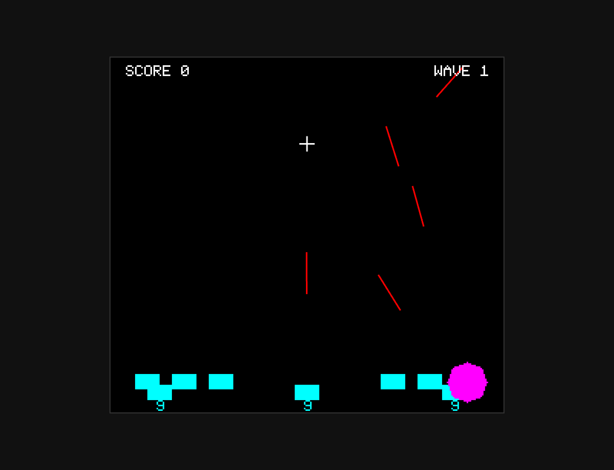

# Missile Command (1980)

A faithful browser-based recreation of Atari's classic **Missile Command** arcade game, featuring **mouse aiming** and **keyboard firing** with authentic octagonal explosions, 10 color schemes, and progressive difficulty.

## Controls

- **Mouse**: Aim crosshair
- **Keys 1, 2, 3**: Fire from left, center, right anti-missile batteries
- **Enter**: Start game

## Gameplay

Defend six cities from incoming ballistic missiles using three anti-missile batteries. Each battery has a limited supply of missiles and different firing speeds:

- **Left/Right silos**: 10 missiles each, slower speed (precise)
- **Center silo**: 10 missiles, faster speed (rapid response)

### Enemy Types
- **ICBMs**: Standard ballistic missiles
- **MIRVs**: Split into 2-3 warheads mid-flight
- **Smart Bombs**: Evade your explosions (wave 3+)
- **Bombers**: Drop bombs on cities (wave 5+)
- **Satellites**: High-altitude targets (wave 7+)

### Scoring
- **Missile destroyed**: 25 points
- **Smart bomb**: 125 points
- **Bomber/Satellite**: 100 points
- **Wave bonuses**: 5 points per remaining ABM, 100 per surviving city
- **Score multiplier**: Increases 1x → 6x over successive waves

## Technical Features

### Authentic 1980 Arcade Mechanics
- **Octagonal explosions** with 3/8 slope (max radius 13px)
- **10 color schemes** cycling every 2 waves (authentic 3-bit RGB palette)
- **MIRV splitting** at altitude 80-160 with multiple warheads
- **Smart bomb evasion** using perpendicular trajectory adjustment
- **Attack pacing**: No spawns while highest ICBM above threshold
- **Collision detection**: Every 5 frames (authentic timing)

### Modern Controls
- **Mouse aiming**: Direct 1:1 position mapping (no acceleration)
- **3-key firing**: Keys 1/2/3 map to left/center/right silos (authentic 3-button arcade layout)
- **Hidden cursor**: Browser cursor hidden, crosshair rendered in-game

## Implementation

- **Resolution**: 256×231 logical pixels, scaled 3x → 768×693 display
- **Rendering**: Pixel-perfect raster graphics with custom octagonal scan-line algorithm
- **Architecture**: 10-section modular design (~2100 lines)
- **Sound**: Web Audio API with 11 distinct sound effects

## Building

Built using parallel agent architecture:
1. **foundations-agent**: CONFIG, MathUtils, SPRITES, InputHandler
2. **audio-entities-agent**: SoundEngine, Entity classes
3. **game-engine-agent**: CollisionSystem, Renderer, Game state machine

All sections concatenated into single `game.js` file for optimal performance.

## Authenticity Notes

Based on original 1980 Atari arcade ROM disassembly analysis:
- Octagonal explosion geometry matches 6502 bit-shifting patterns
- ABM speeds: side silos 3px/frame, center 7px/frame
- 10 authentic color schemes from 3-bit RGB palette
- Wave progression and difficulty curve faithful to original

## Deviations from Original

- **Mouse instead of trackball**: Direct position mapping (more precise than inertial trackball)
- **Keyboard keys instead of physical buttons**: Maps to left/center/right silos authentically
- **No coin-op mechanics**: Free play, no credit system

---

**Year**: 1980
**Developer**: Atari
**Designer**: Dave Theurer
**Platform**: Browser (HTML5 Canvas + JavaScript)
