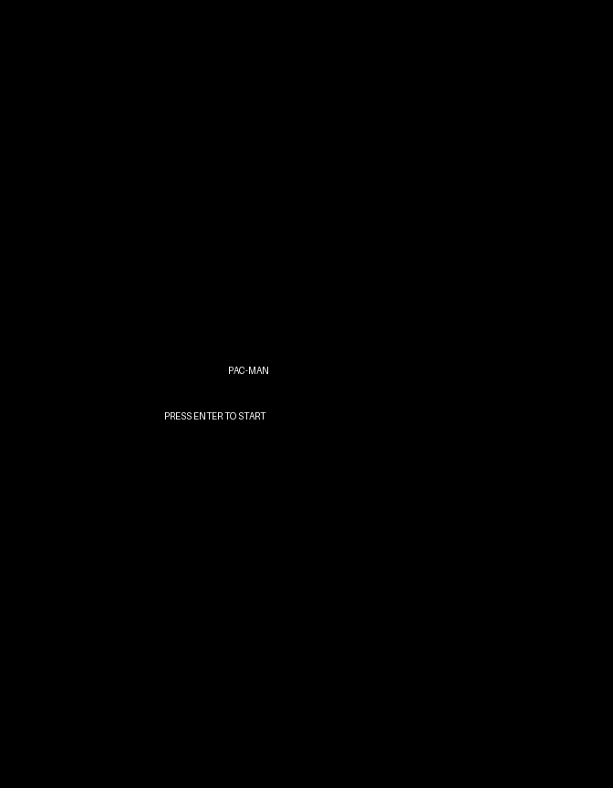
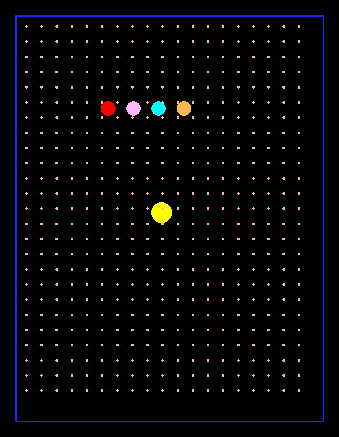

# PAC-MAN (1980)

A faithful browser-based recreation of Namco's iconic maze-chase arcade game. Guide Pac-Man through the maze, eating dots while avoiding ghosts. Turn the tables with power pellets and chase down the frightened ghosts for bonus points.

 

## How to Play

Open `index.html` in a modern web browser. No server required—everything runs client-side.

| Control | Action |
|---------|--------|
| **Arrow Keys** or **WASD** | Move Pac-Man (up, down, left, right) |
| **Enter** | Start game / Restart after game over |

## Features

- **Classic Maze Layout** — Symmetrical design with side tunnels for strategic escapes
- **Four Ghosts** — Blinky (red), Pinky (pink), Inky (cyan), and Clyde (orange) with scatter and chase AI
- **Power Pellets** — Turn ghosts blue and vulnerable for 6 seconds
- **Combo Scoring** — Eat multiple ghosts during power pellet mode: 200, 400, 800, 1600 points
- **Direction Buffering** — Smooth cornering with input buffering for responsive controls
- **Tunnel Wraparound** — Escape through side tunnels to loop to the opposite side
- **Authentic Audio** — Procedural wakka-wakka eating sound, power pellet siren, ghost eaten, and death sounds
- **High Score Persistence** — Local storage saves your best score
- **Extra Lives** — Earn an extra life every 10,000 points

## Game History

### Origins
Pac-Man was created by Toru Iwatani and released by Namco in Japan on May 22, 1980. Iwatani designed the game to appeal to a broader audience beyond the typical shoot-'em-up arcade games of the era, aiming to attract female players and couples. The character's design was inspired by a pizza with a slice removed, and the original Japanese name "Puck-Man" was changed to "Pac-Man" for the North American release to prevent vandalism of arcade cabinets.

### Hardware
The original arcade cabinet ran on a Namco 8-bit PCB featuring:
- **CPU**: Zilog Z80A processor running at 3.072 MHz
- **Display**: 224×288 pixel raster display in portrait orientation
- **Color**: 16-color palette with RGB support
- **Sprites**: Six 16×16 hardware sprites (Pac-Man and five entities)
- **Refresh Rate**: 60.6 Hz
- **Sound**: Custom 3-voice waveform generator
- **Tiles**: 8×8 pixel tile system for maze layout (28×36 grid)

The game used a tile-based rendering system where the maze was stored as a grid, with Pac-Man and the ghosts moving through corridors aligned to this grid.

### Arcade Phenomenon
Pac-Man became a cultural icon and one of the highest-grossing arcade games of all time. By 1982, it had grossed over $1 billion in quarters in the United States alone. The game's success led to merchandise, an animated television series, a top-ten hit single ("Pac-Man Fever"), and countless sequels and spin-offs.

The ghost characters—Blinky, Pinky, Inky, and Clyde—each had distinct AI personalities in the original game, though this recreation simplifies their behavior while maintaining the scatter/chase mode cycling. The game's maze-chase mechanics, power-up system, and character design influenced countless games that followed.

### Legacy
Pac-Man has been recognized by Guinness World Records as the "Most Successful Coin-Operated Arcade Game" and remains one of the longest-running video game franchises. The game has been ported to virtually every gaming platform and continues to be recognized as a symbol of 1980s pop culture and video game history. In 2010, Google celebrated Pac-Man's 30th anniversary with an interactive Google Doodle that could be played directly in the browser.

## Technical Details

This recreation follows the browser-games project's single-file architecture:

| Section | Description | Lines |
|---------|-------------|-------|
| 1. CONFIG | Display, timing, colors, scoring constants | 89 |
| 2. Math Utilities | Grid conversion, collision detection, Manhattan distance | 48 |
| 3. Sprite Data | Pac-Man, ghost, and font sprites (16×16, 14×14, 5×7) | 348 |
| 4. Sound Engine | Procedural audio synthesis (wakka loop, siren, effects) | 203 |
| 5. Input Handler | Keyboard input with WASD and arrow key support | 42 |
| 6. Entity Classes | PacMan and Ghost classes with AI | 458 |
| 7. Collision System | Wall, dot, and ghost collision detection | 70 |
| 8. Renderer | Canvas 2D rendering with state-based screens | 309 |
| 9. Game State Machine | State management, maze parsing, scoring | 234 |
| 10. Main Loop | Fixed-timestep game loop (60 FPS) | 34 |
| **Total** | | **1,835 lines** |

**Rendering**: Portrait-oriented canvas (224×288 logical pixels @ 3× scale = 672×864) with pixel-perfect rendering and `aspect-ratio: 7 / 9` CSS for responsive scaling.

**Movement**: Continuous pixel-based movement with tile-snapped collision detection. Direction buffering allows smooth cornering by accepting input before reaching intersections.

**Ghost AI**: Simplified behavior where all ghosts use the same base AI with three modes:
- **Scatter** (7 sec): Ghosts retreat to their home corners
- **Chase** (20 sec): Ghosts pursue Pac-Man's current position
- **Frightened** (6 sec): Random movement when power pellet is active

**Audio**: All sounds synthesized via Web Audio API oscillators—no audio files. The iconic wakka-wakka eating sound is a square wave alternating between 200 Hz and 400 Hz.

## Implementation Notes

This is a simplified recreation focused on core gameplay. The following features from the original were intentionally omitted for simplicity:
- Fruit spawning (cherry, strawberry, etc.)
- Level progression and increasing difficulty
- Complex ghost AI targeting (Pinky's 4-ahead, Inky's vector math, Clyde's proximity behavior)
- Attract mode demo gameplay
- Ghost house entry queue and staggered release timings

The maze layout is a simplified version of the classic Pac-Man maze, maintaining the recognizable symmetrical design, central ghost house, corner power pellets, and side tunnels.

## License

Fan recreation for educational purposes. Pac-Man is a registered trademark of Bandai Namco Entertainment. This project is not affiliated with or endorsed by Bandai Namco Entertainment.
