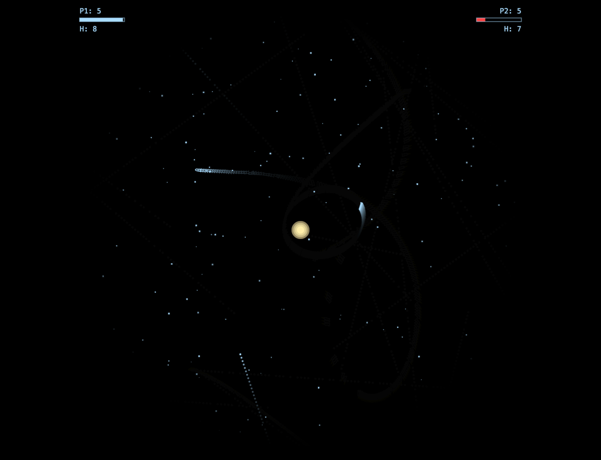

# Spacewar! (1962)

The first influential video game in history. Two spaceships battle with Newtonian physics, gravity, and torpedoes around a deadly central star.

## Game History

**Spacewar!** was created in 1962 at MIT by Steve Russell and fellow members of the Tech Model Railroad Club, running on the PDP-1 computer with its Type 30 circular CRT display. It's considered the first influential video game, directly inspiring Computer Space (1971) and the entire arcade industry that followed.

### Original Hardware
- **PDP-1 Computer**: $120,000 mainframe (1959)
- **Type 30 CRT Display**: 1024×1024 resolution, circular phosphor tube
- **P7 Phosphor**: Blue-white primary glow with yellowish-green persistence
- **Custom Controllers**: Sense switches and toggle switches (no joysticks yet!)

### Cultural Impact
- First game to spread virally across early computer labs
- Inspired Nolan Bushnell to create Computer Space (1971)
- Established core mechanics still used today: space combat, gravity wells, hyperspace
- Demonstrated computers could be used for entertainment, not just calculation

## Controls

### Player 1 (Needle)
- **A / D** - Rotate left/right
- **W** - Thrust
- **S / Q** - Fire torpedo
- **E** - Hyperspace (emergency escape)

### Player 2 (Wedge)
- **Arrow Keys** - Rotate and thrust
- **Down / Slash** - Fire torpedo
- **Period** - Hyperspace

### Game Options
- **2** - Toggle AI opponent (on attract screen)
- **Enter** - Start game / Continue after game over

## Features

### Authentic Physics
- **Pure Newtonian motion**: Ships coast forever with no drag or friction
- **Inverse-square gravity**: Central star pulls ships toward death
- **Orbital mechanics**: Skilled players can achieve stable orbits
- **Speed cap**: Maximum velocity prevents escape from playfield

### Combat Mechanics
- **Limited torpedoes**: Max 8 concurrent per ship, 10-frame reload
- **No torpedo gravity**: Authentic CPU limitation - torpedoes fly straight
- **Star collision**: Instant death within 12-pixel capture radius
- **Toroidal wraparound**: All edges connect seamlessly

### Resource Management
- **Fuel system**: 256 units max, burns 0.5/frame while thrusting
- **No thrust when empty**: Ships become sitting ducks without fuel
- **Hyperspace jumps**: 8 maximum, increasing failure probability
  - Jump 1: 12.5% failure (explode)
  - Jump 8: 100% failure (certain death)

### Visual Authenticity
- **Circular CRT display**: Authentic Type 30 phosphor tube vignetting
- **Blue-white phosphor**: Primary glow at #aaddff (not cyan like Asteroids)
- **Green trails**: Persistence at #77cc88 (yellowish-green like P7)
- **Deterministic starfield**: 200 stars at 4 brightness levels
- **Multi-layer star glow**: Yellow-white central star with soft halo

### AI Opponent
- **Star avoidance**: Turns away from danger, uses emergency hyperspace
- **Target leading**: Calculates intercept angles with inaccuracy
- **Fuel management**: Conserves fuel when low
- **Challenging but beatable**: Designed for fun single-player experience

## Technical Implementation

### Architecture (10-section modular design)
- **Section 1**: CONFIG (71 lines) - All constants frozen
- **Section 2**: MathUtils (89 lines) - Gravity, toroidal distance, seeded RNG
- **Section 3**: SHAPES + Starfield (294 lines) - PDP-1 ship vertices, vector font
- **Section 4**: SoundEngine (220 lines) - P7-era synthesized tones
- **Section 5**: InputHandler (84 lines) - Two-player keyboard with buffer
- **Section 6**: Entity Classes (308 lines) - Ship, Torpedo, Particle, AI
- **Section 7**: CollisionSystem (60 lines) - Toroidal circle collision
- **Section 8**: Renderer (400 lines) - Two-canvas phosphor persistence
- **Section 9**: Game State Machine (620 lines) - Full game flow
- **Section 10**: Main Loop (70 lines) - 60 FPS accumulator

**Total:** 2,216 lines

### Key Technical Achievements
- **Two-canvas phosphor persistence**: Slower fade than Asteroids for smoother trails
- **Toroidal collision detection**: Shortest distance across wraparound boundaries
- **Deterministic starfield**: Same star pattern every time using seeded RNG
- **Circular vignette**: Authentic CRT tube masking with radial gradient
- **Event-driven input**: Separate handling for held keys vs. one-shot actions

### Parallel Build Strategy
Built by 3 agents working simultaneously in separate git worktrees:
- **Agent 1**: Foundations (CONFIG, MathUtils, SHAPES, Input) - 538 lines
- **Agent 2**: Audio + Entities (Sound, Ship, Torpedo, AI) - 528 lines
- **Agent 3**: Game Engine (Collision, Renderer, State Machine) - 1,150 lines

Assembly: `cat sections-1-3-5.js sections-4-6.js sections-7-10.js > game.js`

## Play the Game

Open `spacewar/index.html` in a modern web browser. No build step required.

Recommended: Play in fullscreen for the authentic circular CRT experience.

## Lessons Learned

### Bug Fixes During Development
1. **SoundManager → SoundEngine**: Class name mismatch in main loop
2. **wrapPosition return type**: Changed from array `[x,y]` to object `{x,y}`
   - Bug caused ships to have undefined x/y coordinates
   - Ships existed and updated but were invisible due to undefined positions

### Authenticity Notes

**Faithful to Original:**
- Ship shapes from PDP-1 direction codes
- Gravity inverse-square law (ships only, not torpedoes)
- Hyperspace 8-jump limit with linear failure probability
- No drag/friction (pure Newtonian mechanics)
- Circular CRT display with P7 phosphor colors
- Deterministic starfield (inspired by Expensive Planetarium)

**Modern Enhancements (Documented):**
- 60 FPS (original ~22 FPS variable)
- Sound effects (PDP-1 had no audio hardware)
- AI opponent (original was 2-player only)
- Lives system (original was freeform)
- Keyboard controls (original used custom switches)

## Development Stats

- **Build time**: ~2 hours (parallel agent development)
- **Lines of code**: 2,216
- **Bugs found**: 2 (both fixed immediately)
- **Historical research**: Extensive (PDP-1 documentation, MIT archives)

## License

Fan recreation of public domain game. Original Spacewar! (1962) by Steve Russell and MIT.

For educational and historical preservation purposes.
